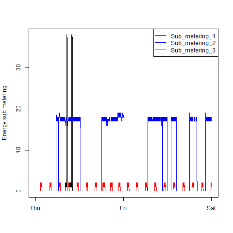
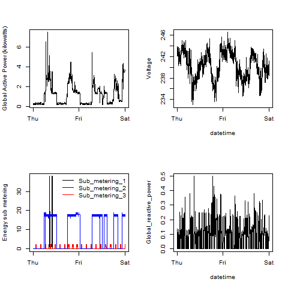

# Read Me First

### About the code  
  
A few things:  

*   To successfully perform the analysis with the scripts on this repo, you must 
    have the dplyr package installed.  If you do not, simply uncomment the 
    line at the beginning of the script and it will be installed for you.
  
*  Please forgive the redundacy in the portion of the code that reads
    the data.  Given the instructions, it was necessary to include the reading
    function  in each script.  Furthermore, I chose to include the code rather
    than calling another script as in previous classes that proved confusing to
    some evaluators.
    
*  Once you have waded through the download/unzip/reading/formatting code in the
    first script, you may skip all of this by searching for the word: plotting  
    
*   While the images on the repo are within the 'figure' directory, the 
    script writes the plots to the working directory

### About the Data

This assignment uses data from
the <a href="http://archive.ics.uci.edu/ml/">UC Irvine Machine
Learning Repository</a>, a popular repository for machine learning
datasets. In particular, we will be using the "Individual household
electric power consumption Data Set" which I have made available on
the course web site:

* <b>Dataset</b>: <a href="https://d396qusza40orc.cloudfront.net/exdata%2Fdata%2Fhousehold_power_consumption.zip">Electric power consumption</a> [20Mb]

* <b>Description</b>: Measurements of electric power consumption in
one household with a one-minute sampling rate over a period of almost
4 years. Different electrical quantities and some sub-metering values
are available.
 
(From Roger Peng's original readme)

### About the images
For your convenience, I have included a comparison of the images generated by
my code, as well as the originals from Roger's repo.  The plots, as you may 
notice, do not match exactly.  In addition to being  different sizes 
(mine: 480x480 pixels per instructions, vs. Roger's 509x509), 
it appears that the originals were written at a higher resolution than the 
default for the PNG graphics device in R.

### Plot 1

<b>Roger's Original:</b>   

 

<b>My Result:</b>   

  

### Plot 2

<b>Roger's Original:</b>   

 

<b>My Result:</b>     

  

### Plot 3

<b>Roger's Original:</b>  
 

<b>My Result:</b>    

  

### Plot 4

<b>Roger's Original:</b>  

  

<b>My Result:</b>   

 